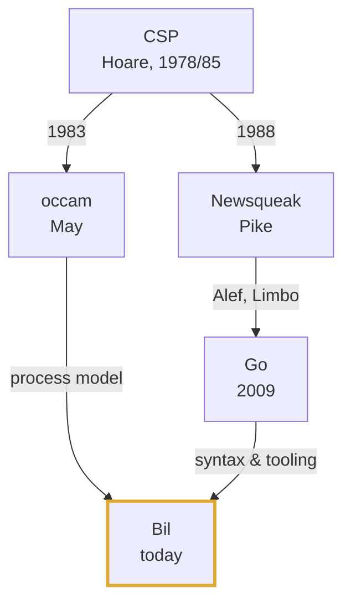

**Bil**: a variant of Go for parallel processor systems.

Bil and Go both have concurrency models that are heavily inspired by Hoare's CSP.

Go is a general-purpose language that borrows CSP's channel-and-process ideas but relaxes them with buffering, dynamic concurrency, and conventional shared-memory mechanisms

Bil is a special-purpose language for parallel processor systems; influenced by CSP, by Go and by May's occam. Built on the Go toolchain, it constrains and shapes the Go concurrency model to encourage a higher level of discipline as needed by parallel systems. Bil helps coders to reason about their process models and to selectively place processes on to physical processors.

Bil is intended for parallel processor systems, but also efficiently supports single processor and multicore shared memory processor architectures for easier reasoning about concurrent code, software development and educational purposes. A Bil emulator (`WASM`) implements a parallel processor mesh to model and test massively parallel systems.

